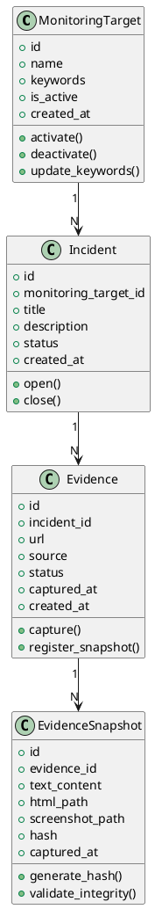

```plantuml
@startuml

class MonitoringTarget {
    +id
    +name
    +keywords
    +is_active
    +created_at

    +activate()
    +deactivate()
    +update_keywords()
}

class Incident {
    +id
    +monitoring_target_id
    +title
    +description
    +status
    +created_at

    +open()
    +close()
}

class Evidence {
    +id
    +incident_id
    +url
    +source
    +status
    +captured_at
    +created_at

    +capture()
    +register_snapshot()
}

class EvidenceSnapshot {
    +id
    +evidence_id
    +text_content
    +html_path
    +screenshot_path
    +hash
    +captured_at

    +generate_hash()
    +validate_integrity()
}

MonitoringTarget "1" --> "N" Incident
Incident "1" --> "N" Evidence
Evidence "1" --> "N" EvidenceSnapshot

@enduml
```